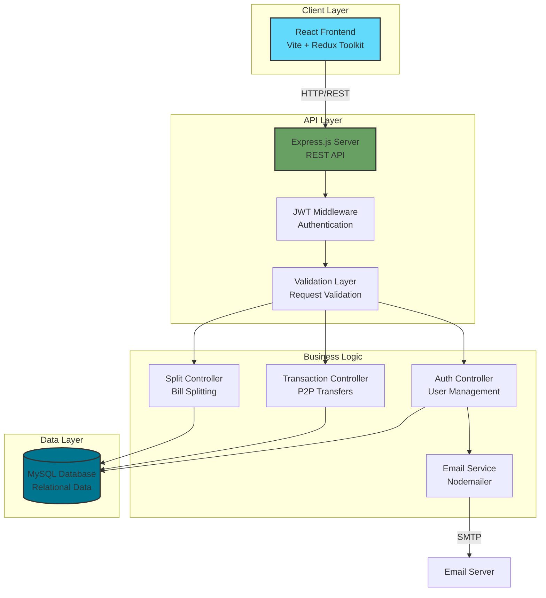
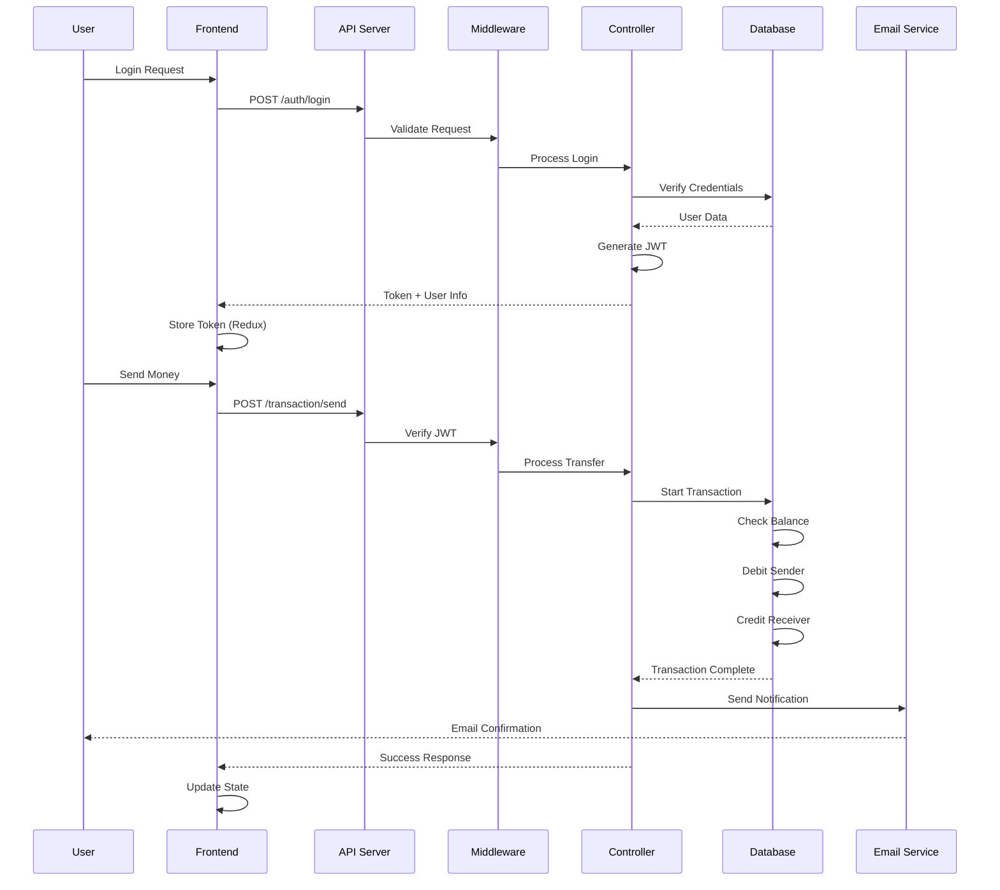
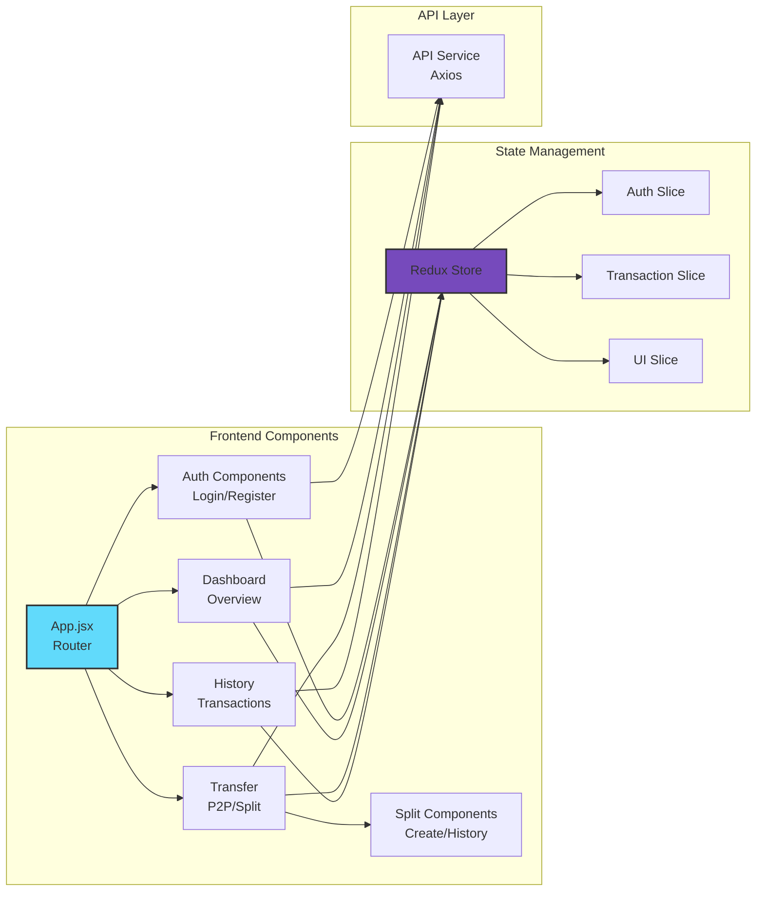
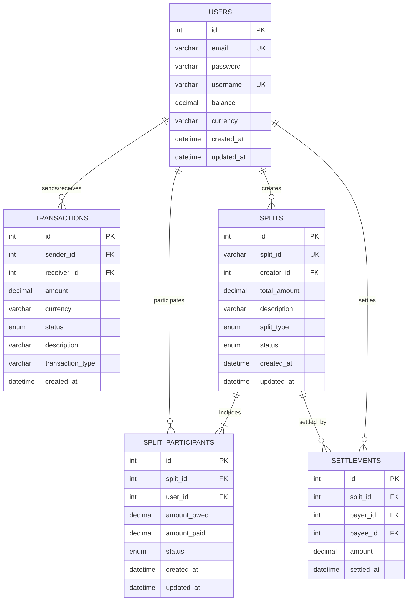

<div align="center">

# 💸 FinFlow

### Full-Stack Fintech Platform for Seamless Money Management

[](https://opensource.org/licenses/MIT)
[](https://nodejs.org/)
[](https://reactjs.org/)
[](https://www.mysql.com/)

*A modern fintech web application enabling secure peer-to-peer transfers, bill splitting, and comprehensive transaction management*

</div>

---

## 🎯 Overview

**FinFlow** is a comprehensive fintech platform that simplifies money management through an intuitive interface. Built with modern web technologies, it provides users with the ability to transfer money securely, split bills with friends (Splitwise-style), track transactions in real-time, and manage their finances efficiently.

### What Makes FinFlow Special?

- 🔐 **Bank-Grade Security**: JWT-based authentication with secure password hashing
- 💱 **Multi-Currency Support**: Handle transactions in multiple currencies
- 🧾 **Smart Bill Splitting**: Splitwise-inspired feature for group expenses
- 📊 **Real-Time Insights**: Live transaction dashboard with comprehensive history
- 📧 **Password Recovery**: Secure email-based password reset mechanism
- 🎨 **Responsive Design**: Seamless experience across all devices

---

## 🚀 Key Features

### Core Functionality

#### 💸 Peer-to-Peer Transfers
- Instant money transfers between users
- Transaction validation and atomic database operations
- Real-time balance updates
- Transaction status tracking (pending, completed, failed)

#### 🧾 Bill Splitting (Splitwise)
- Create splits with multiple participants
- Support for equal and custom split amounts
- Unique split ID generation for easy sharing
- Settlement tracking with automatic balance reconciliation
- Complete split history with status indicators

#### 🔐 Authentication & Security
- JWT-based stateless authentication
- Bcrypt password hashing (10 salt rounds)
- Token expiration and refresh mechanisms
- Secure session management
- Email-based password reset with temporary tokens

#### 📊 Transaction Management
- Comprehensive transaction history
- Advanced filtering (date range, type, status)
- Transaction categorization
- Export capabilities
- Real-time balance tracking

#### 📧 Email Services
- Welcome emails for new users
- Transaction confirmation notifications
- Password reset links
- Split invitation emails

---

## 🏗️ System Architecture

### High-Level Architecture



### Application Flow



### Component Architecture



---

## 🗄️ Database Schema

### Entity Relationship Diagram


---

## 🛠️ Tech Stack

### Frontend
| Technology | Purpose | Version |
|------------|---------|---------|
| **React** | UI Framework | 18+ |
| **Vite** | Build Tool | Latest |
| **Redux Toolkit** | State Management | Latest |
| **React Router** | Navigation | v6+ |
| **Axios** | HTTP Client | Latest |
| **CSS3** | Styling | - |

### Backend
| Technology | Purpose | Version |
|------------|---------|---------|
| **Node.js** | Runtime Environment | v16+ |
| **Express.js** | Web Framework | Latest |
| **JWT** | Authentication | jsonwebtoken |
| **Bcrypt** | Password Hashing | Latest |
| **Nodemailer** | Email Service | Latest |
| **CORS** | Cross-Origin Resource Sharing | Latest |

### Database
| Technology | Purpose | Version |
|------------|---------|---------|
| **MySQL** | Primary Database | 8.0+ |
| **mysql2** | Node.js Driver | Latest |

### DevOps & Tools
- **Git** - Version Control
- **npm** - Package Management
- **dotenv** - Environment Variables

---

## 🚀 Quick Start

### Prerequisites

Ensure you have the following installed:
- Node.js (v16 or higher)
- MySQL Server (v8.0 or higher)
- npm or yarn
- Git

### Installation Steps

#### 1️⃣ Clone the Repository
```bash
git clone https://github.com/kd5778/FinFlow.git
cd FinFlow
```

#### 2️⃣ Database Setup
```bash
# Ensure MySQL is running
# Run the automated database setup script
node database/setup-db.js
```

This script will:
- Create the `finflow_db` database
- Set up all required tables (users, transactions, splits, split_participants, settlements)
- Add necessary indexes
- Create initial constraints

#### 3️⃣ Backend Configuration
```bash
cd backend
npm install

# Create .env file (see Environment Configuration section)
# Start the backend server
npm start
```

Backend will run on: **http://localhost:4000**

#### 4️⃣ Frontend Configuration
```bash
cd frontend
npm install

# Create .env file (see Environment Configuration section)
# Start the development server
npm run dev
```

Frontend will run on: **http://localhost:5173**

### Verification

1. Visit `http://localhost:5173` in your browser
2. Register a new account
3. Check your email for welcome message
4. Login and explore the dashboard

---

## 📁 Project Structure

```
FinFlow/
│
├── backend/                    # Backend Express.js application
│   ├── controllers/           # Business logic controllers
│   │   ├── authController.js
│   │   ├── transactionController.js
│   │   └── splitController.js
│   ├── middleware/            # Custom middleware
│   │   ├── auth.js           # JWT verification
│   │   └── validation.js     # Request validation
│   ├── routes/               # API route definitions
│   │   ├── auth.js
│   │   ├── transactions.js
│   │   └── splits.js
│   ├── utils/                # Utility functions
│   │   ├── emailService.js   # Nodemailer configuration
│   │   └── helpers.js
│   ├── config/               # Configuration files
│   │   └── database.js       # MySQL connection
│   ├── server.js             # Main server file
│   ├── package.json
│   └── .env.example
│
├── frontend/                  # React frontend application
│   ├── src/
│   │   ├── components/       # React components
│   │   │   ├── Auth/
│   │   │   │   ├── Login.jsx
│   │   │   │   └── Register.jsx
│   │   │   ├── Dashboard/
│   │   │   │   └── Dashboard.jsx
│   │   │   ├── Transfer/
│   │   │   │   ├── Transfer.jsx
│   │   │   │   ├── SplitBill.jsx
│   │   │   │   └── SplitHistory.jsx
│   │   │   └── History/
│   │   │       └── TransactionHistory.jsx
│   │   ├── store/            # Redux store
│   │   │   ├── store.js
│   │   │   ├── authSlice.js
│   │   │   └── transactionSlice.js
│   │   ├── api/              # API service layer
│   │   │   └── axiosConfig.js
│   │   ├── styles/           # CSS files
│   │   ├── utils/            # Helper functions
│   │   ├── App.jsx           # Main app component
│   │   └── main.jsx          # Entry point
│   ├── public/
│   ├── index.html
│   ├── package.json
│   ├── vite.config.js
│   └── .env.example
│
├── database/                  # Database scripts
│   ├── setup-db.js           # Automated setup script
│   ├── create-splits.sql     # Split tables schema
│   └── migrations/           # Database migrations
│
├── .gitignore
├── LICENSE
├── README.md
└── TODO-splitwise.md         # Feature implementation tracker
```

---

## 📡 API Documentation

### Base URL
```
http://localhost:4000/api
```

### Authentication Endpoints

#### Register User
```http
POST /auth/register
Content-Type: application/json

{
  "email": "user@example.com",
  "password": "securePassword123",
  "username": "johndoe"
}

Response: 201 Created
{
  "success": true,
  "message": "User registered successfully",
  "token": "eyJhbGciOiJIUzI1NiIsInR5cCI6IkpXVCJ9...",
  "user": {
    "id": 1,
    "email": "user@example.com",
    "username": "johndoe",
    "balance": 0.00
  }
}
```

#### Login
```http
POST /auth/login
Content-Type: application/json

{
  "email": "user@example.com",
  "password": "securePassword123"
}

Response: 200 OK
{
  "success": true,
  "token": "eyJhbGciOiJIUzI1NiIsInR5cCI6IkpXVCJ9...",
  "user": {
    "id": 1,
    "email": "user@example.com",
    "username": "johndoe",
    "balance": 1000.00
  }
}
```

#### Password Reset Request
```http
POST /auth/forgot-password
Content-Type: application/json

{
  "email": "user@example.com"
}

Response: 200 OK
{
  "success": true,
  "message": "Password reset link sent to email"
}
```

### Transaction Endpoints

#### Send Money
```http
POST /transactions/send
Authorization: Bearer {token}
Content-Type: application/json

{
  "receiverId": 2,
  "amount": 100.00,
  "currency": "USD",
  "description": "Lunch payment"
}

Response: 200 OK
{
  "success": true,
  "message": "Transaction completed successfully",
  "transaction": {
    "id": 123,
    "sender_id": 1,
    "receiver_id": 2,
    "amount": 100.00,
    "status": "completed",
    "created_at": "2024-01-15T10:30:00Z"
  },
  "newBalance": 900.00
}
```

#### Get Transaction History
```http
GET /transactions/history?page=1&limit=20&status=completed
Authorization: Bearer {token}

Response: 200 OK
{
  "success": true,
  "transactions": [...],
  "pagination": {
    "page": 1,
    "limit": 20,
    "total": 150
  }
}
```

### Split Endpoints

#### Create Split
```http
POST /splits/create
Authorization: Bearer {token}
Content-Type: application/json

{
  "totalAmount": 300.00,
  "description": "Dinner at Italian Restaurant",
  "splitType": "equal",
  "participants": [
    { "userId": 2, "amount": 100.00 },
    { "userId": 3, "amount": 100.00 },
    { "userId": 4, "amount": 100.00 }
  ]
}

Response: 201 Created
{
  "success": true,
  "message": "Split created successfully",
  "split": {
    "split_id": "SPL-ABC123XYZ",
    "total_amount": 300.00,
    "creator_id": 1,
    "status": "active"
  }
}
```

#### Get Split Details
```http
GET /splits/:splitId
Authorization: Bearer {token}

Response: 200 OK
{
  "success": true,
  "split": {
    "split_id": "SPL-ABC123XYZ",
    "total_amount": 300.00,
    "description": "Dinner at Italian Restaurant",
    "status": "active",
    "participants": [...]
  }
}
```

#### Settle Split
```http
POST /splits/:splitId/settle
Authorization: Bearer {token}
Content-Type: application/json

{
  "amount": 100.00
}

Response: 200 OK
{
  "success": true,
  "message": "Split settled successfully",
  "settlement": {
    "amount": 100.00,
    "settled_at": "2024-01-15T15:45:00Z"
  }
}
```

---

## 🔧 Environment Configuration

### Backend Environment (.env)

```bash
# Server Configuration
PORT=4000
NODE_ENV=development
FRONTEND_ORIGIN=http://localhost:5173

# JWT Configuration
JWT_SECRET=your_super_secret_jwt_key_change_this_in_production
JWT_EXPIRE=7d

# Database Configuration
DB_HOST=localhost
DB_PORT=3306
DB_USER=root
DB_PASSWORD=your_mysql_password
DB_NAME=finflow_db

# Email Service Configuration (SMTP)
SMTP_HOST=smtp.gmail.com
SMTP_PORT=587
SMTP_USER=your_email@gmail.com
SMTP_PASS=your_app_specific_password
SMTP_SECURE=false

# Application
APP_NAME=FinFlow
APP_URL=http://localhost:5173
```

### Frontend Environment (.env)

```bash
# API Configuration
VITE_API_URL=http://localhost:4000/api
VITE_API_TIMEOUT=10000

# Application
VITE_APP_NAME=FinFlow
VITE_APP_VERSION=1.0.0
```

---

## 🔒 Security Features

### Authentication & Authorization
- **JWT Tokens**: Stateless authentication with secure token generation
- **Password Hashing**: Bcrypt with 10 salt rounds
- **Token Expiration**: Configurable token lifetime (default: 7 days)
- **Protected Routes**: Middleware-based route protection
- **CORS Configuration**: Restricted to frontend origin only

### Transaction Security
- **Atomic Operations**: Database transactions ensure data consistency
- **Balance Validation**: Insufficient fund checks before transfer
- **Amount Validation**: Positive number and decimal validation
- **User Verification**: Token-based user identity confirmation
- **Race Condition Prevention**: Database locks during concurrent transactions

### Data Protection
- **SQL Injection Prevention**: Parameterized queries
- **XSS Protection**: Input sanitization
- **Password Strength**: Minimum 8 characters requirement
- **Secure Headers**: HTTP security headers implementation
- **Environment Variables**: Sensitive data in .env files

### Email Security
- **Password Reset Tokens**: Time-limited reset tokens
- **Email Verification**: Ownership confirmation
- **Secure SMTP**: TLS/SSL encryption for email transmission

---

## 🛣️ Future Prospects

### Phase 1: Core Enhancement
- [ ] Two-Factor Authentication (2FA)
- [ ] OAuth Integration (Google, GitHub)
- [ ] Transaction receipt generation (PDF)
- [ ] Enhanced analytics dashboard

### Phase 2: Advanced Features
- [ ] Open Banking Integration (Plaid/TrueLayer)
- [ ] Recurring payments setup
- [ ] Budget tracking and alerts
- [ ] Multi-language support

### Phase 3: Mobile & Scale
- [ ] Mobile app (React Native)
- [ ] Real-time notifications (WebSockets)
- [ ] Advanced reporting with charts
- [ ] Admin dashboard

### Phase 4: Enterprise
- [ ] API rate limiting
- [ ] Merchant payment gateway
- [ ] Cryptocurrency support
- [ ] Advanced fraud detection

---

## 🐛 Troubleshooting

### Common Issues

#### Database Connection Failed
```bash
Error: connect ECONNREFUSED 127.0.0.1:3306
```
**Solution**: 
- Ensure MySQL server is running: `sudo systemctl start mysql`
- Verify credentials in `.env` file
- Check if port 3306 is available

#### JWT Token Invalid
```bash
Error: jwt malformed
```
**Solution**:
- Clear browser localStorage
- Re-login to get new token
- Check `JWT_SECRET` matches in backend

#### Port Already in Use
```bash
Error: listen EADDRINUSE: address already in use :::4000
```
**Solution**:
```bash
# Find and kill process using port 4000
lsof -ti:4000 | xargs kill -9
# Or use different port in .env
```

#### Email Not Sending
```bash
Error: Invalid login: 535-5.7.8 Username and Password not accepted
```
**Solution**:
- Enable "Less secure app access" for Gmail
- Use App-Specific Password instead
- Verify SMTP credentials in `.env`

---

## 📄 License

This project is licensed under the **MIT License** - see the [LICENSE](LICENSE) file for details.

```
MIT License

Copyright (c) 2024 FinFlow

Permission is hereby granted, free of charge, to any person obtaining a copy
of this software and associated documentation files (the "Software"), to deal
in the Software without restriction...
```

---

## 📞 Contact & Support

- **Issues**: [GitHub Issues](https://github.com/kd5778/FinFlow/issues)
- **Discussions**: [GitHub Discussions](https://github.com/kd5778/FinFlow/discussions)
- **Email**: iib2024008@iiita.ac.in / iib2024009@iiita.ac.in / iib2024010@iiita.ac.in /
 iib2024027@iiita.ac.in /
iiib2024041@iiita.ac.in/ 
---
